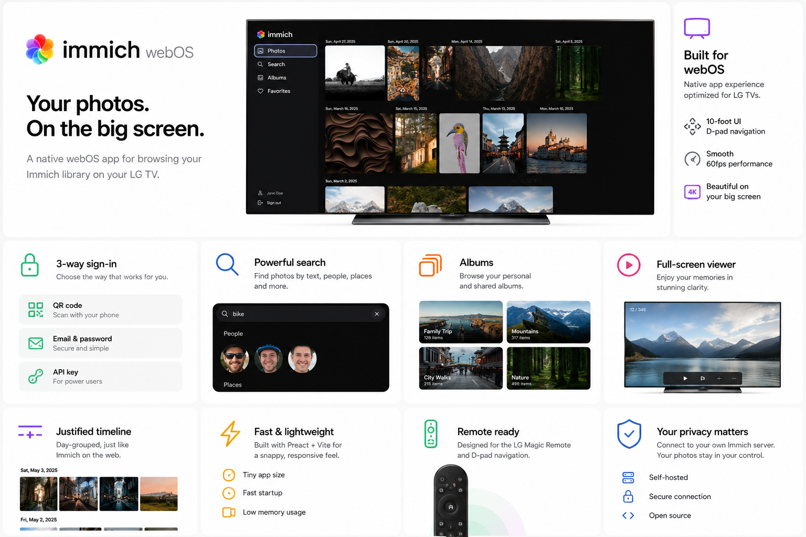
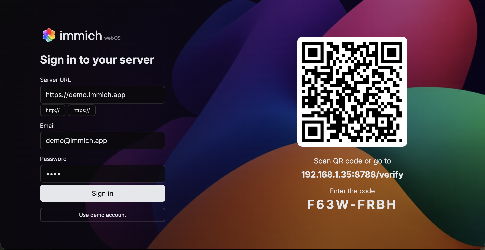
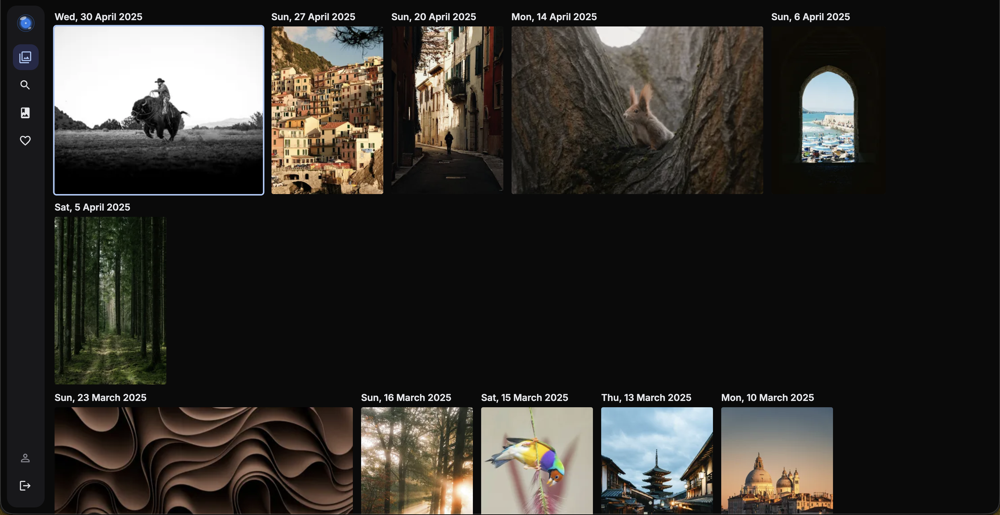
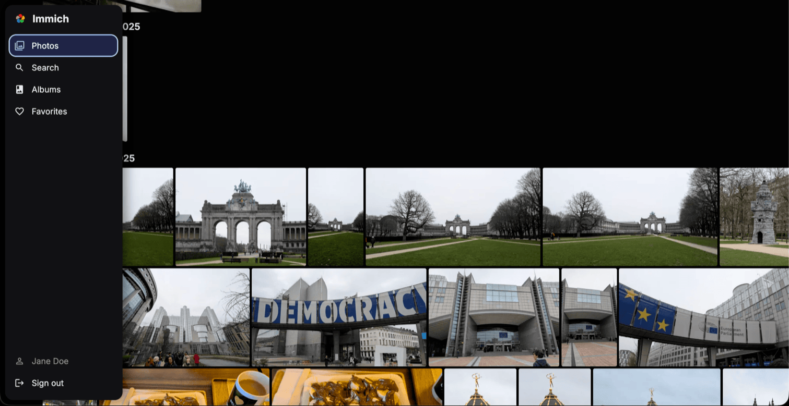
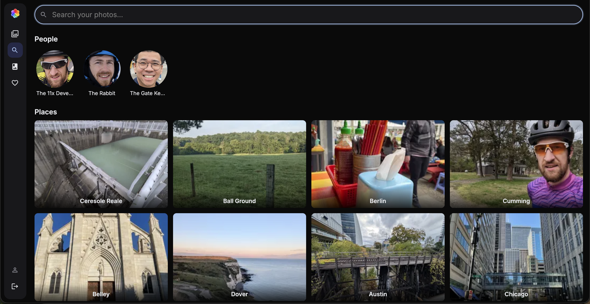
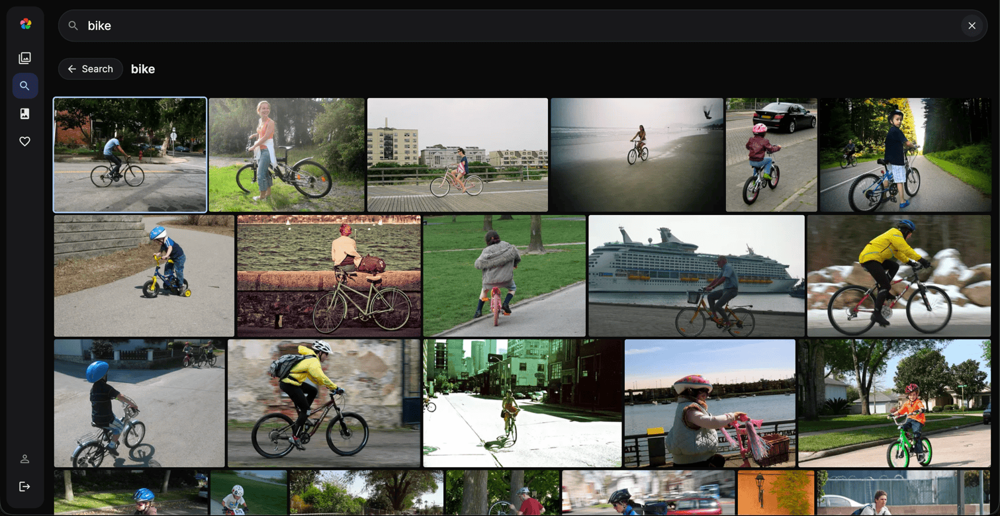
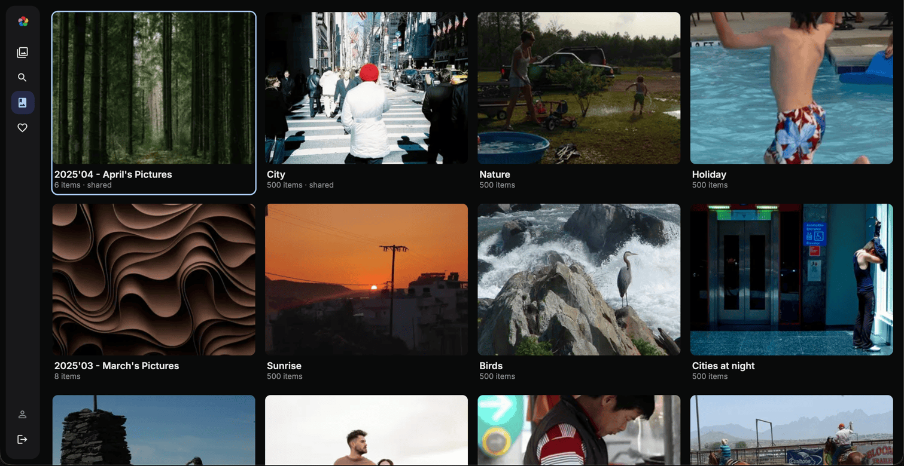

<p align="center">
  <picture>
    <source media="(prefers-color-scheme: dark)" srcset="screenshots/banner-dark.svg" />
    
  </picture>
</p>

<p align="center">
  <a href="https://github.com/aneeshtigga/immich-webos/releases"></a>
  <a href="LICENSE"></a>
  
  
  
  
</p>

<p align="center">
  <a href="https://github.com/aneeshtigga/immich-webos/stargazers"></a>
</p>

A native [webOS](https://webostv.developer.lge.com/) TV app for browsing your [Immich](https://immich.app/) photo and video server from the couch.

> Unofficial, community-built app — not affiliated with the [Immich project](https://immich.app). "Immich" is a trademark of its owners.

<p align="center">
  <picture>
    <source media="(prefers-color-scheme: dark)" srcset="screenshots/specs_dark2.png" />
    
  </picture>
</p>

---

## Requirements


- An [Immich](https://immich.app/) server you can reach from the TV
- An LG TV running webOS 5.0 or above

---

## Install guide

Pick **one** of the two methods below

### 🍺 From the Homebrew Channel (recommended)

The app is on the official [webOS Homebrew](https://www.webosbrew.org/) repo. Open the **Homebrew App** on your TV, find **immich webOS** in the app list, and install it.

### 📦 From a downloaded .ipk

[](https://github.com/aneeshtigga/immich-webos/releases/latest/download/com.immich.webos.ipk)

Grab the latest `com.immich.webos.ipk` from the download button above, then sideload it onto a TV in [developer mode](https://webostv.developer.lge.com/develop/getting-started/developer-mode-app):

```bash
ares-install --device <your-device> com.immich.webos.ipk
```

---

## Screenshots

<table>
  <tr>
    <td width="50%" align="center">
      
    </td>
    <td width="50%" align="center">
      
    </td>
  </tr>
  <tr>
    <td width="50%" align="center">
      
    </td>
    <td width="50%" align="center">
      
    </td>
  </tr>
  <tr>
    <td width="50%" align="center">
      
    </td>
    <td width="50%" align="center">
      
    </td>
  </tr>
</table>

> Screenshots use the public Immich [demo server](https://demo.immich.app).

---

## Sign in with your phone (QR)

The login screen can show a QR code that lets you sign in from your phone
instead of typing on the remote, using the standard
[OAuth 2.0 Device Authorization Grant (RFC 8628)](https://datatracker.ietf.org/doc/html/rfc8628).

On a webOS TV this works **out of the box** — a small JS service bundled in the
app (`service/`) runs the pairing flow on the TV itself and logs in to your
Immich server, so there's no external server to host and self-signed / no-CORS
Immich instances work. The phone scans the QR (or opens the printed URL and
enters the 8-character code), submits your Immich URL + credentials to the TV,
and the TV signs in automatically. Credentials are used once and never stored.

In a **desktop browser** (dev), there's no on-device service, so the QR panel
is hidden unless you point it at an external relay:

```bash
VITE_PAIR_ISSUER=https://your-relay.example npm run build
```

A reference relay implementation lives in [`relay/`](relay/) (see its
[README](relay/README.md)); [`relay/PROPOSAL.md`](relay/PROPOSAL.md) describes
the contract for Immich to implement the device flow natively.

### Logging in with an API Key

Prefer an API key over full account access? Create the key with only these
permissions:

- `user.read`
- `timeline.read`
- `album.read`
- `asset.read`
- `asset.view`
- `person.read`

---

## Development


```bash
npm install        # patch-package runs automatically via postinstall
npm run dev        # Vite dev server at http://localhost:5173
```

In the browser, the remote is emulated: arrow keys = D-pad, Enter = select, **Esc** = Back.

### CORS in the dev browser

Sign-in may fail with **"Could not reach server… (Failed to fetch)"** even when the server is reachable. This is a browser-only quirk: depending on its config, an Immich server may not return an `Access-Control-Allow-Origin` header, so the browser blocks the cross-origin request from `http://localhost:5173`. The packaged TV app is unaffected — webOS loads from a `file://` origin and doesn't enforce CORS the same way.

To test sign-in locally, launch Chrome with web security disabled in a throwaway profile:

```bash
# macOS
open -na "Google Chrome" --args \
  --user-data-dir=/tmp/chrome-immich-dev \
  --disable-web-security \
  http://localhost:5173
```

```powershell
# Windows (PowerShell)
& "C:\Program Files\Google\Chrome\Application\chrome.exe" `
  --user-data-dir="$env:TEMP\chrome-immich-dev" `
  --disable-web-security `
  http://localhost:5173
```

```bash
# Linux
google-chrome \
  --user-data-dir=/tmp/chrome-immich-dev \
  --disable-web-security \
  http://localhost:5173
```

Use this window only for local dev — it has web security turned off.

---

## Build & deploy to a TV

The deploy scripts target a webOS device registered with `ares-setup-device` under the name `lg_c2`. Rename in `package.json` to match your device.

```bash
npm run build      # type-check + production bundle into dist/
npm run package    # build, then ares-package into out/*.ipk
npm run deploy     # package + install on the TV + launch
```

Individual steps:

```bash
npm run install-tv # ares-install the .ipk onto lg_c2
npm run launch     # ares-launch the installed app
```

---

## License

[](LICENSE)
